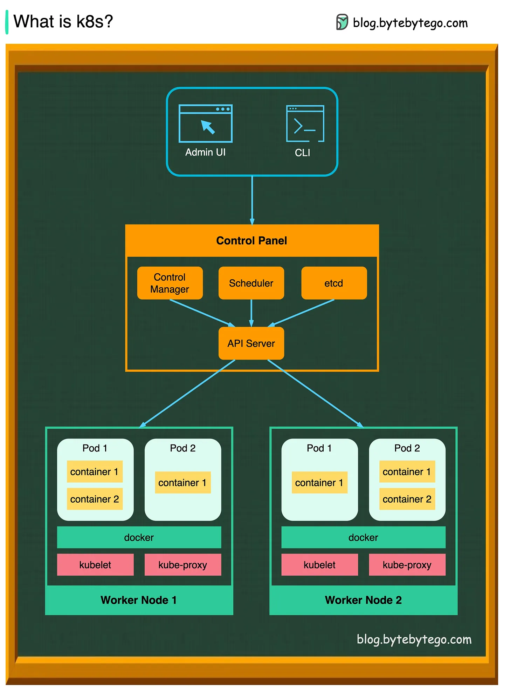
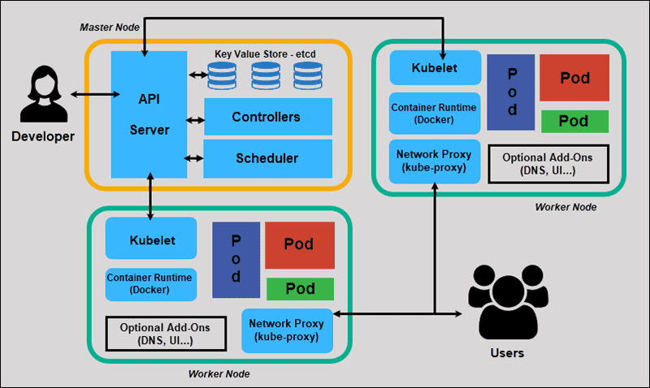

## kubernets cluster(container orchestrator)

pod, node, worker

            KUBERNETE CLUSTER

                master
        /          |        \
worker1          worker2         worker3
o o o            o o o           o o o
o o o            o o o           o o o
Docker           Docker          Docker


NOTE: 
1. if worker is down, another is created by master
2. if master is down, until the next request comes cluster is continued to run. Hence need to create multiple master, keeping one of them as leader/primary 


+---------------------------+
|           Monolith        |
+---------------------------+
| +----------+ +----------+ |
| | App 1    | | App 2    | |
| +----------+ +----------+ |
| +----------+ +----------+ |
| | App 3    | | App 4    | |
| +----------+ +----------+ |
+---------------------------+

## Kuberetes providers:

                        KUBERNETS
    /          |             |           |         \          
EKS            AKS          GKE          RKE     Openshift
AWS            Azure        

## Architecture of Kubernetes:



Control flow
a. K8s Admin(UI/CLI)
        \/
Control panel
a. API Server
b. Scheduler

Workder Node
a. create pods, instructed by API Server

Control Panel
a. etcd DB
b. Control Manager


1. K8s Admin (UI / CLI)
+ deploy app with 3 container

2. Control Panel
+ Kube API Server
+ Kube Scheduler
+ etcd Database
+ control manager
    - node controller - node
    - replication controller - pod
    - endpoint controller - manage/association with service and pod

3. Worker Node
+ Kublet - create pods
+ KubeProxy - entry for the traffic between pods




## Installation 

ec2 -> 3 server -> name -> ubuntu 22.0 -> key value -> all traffic -> cpu t3 medium -> storage gp3 25

Kubernets-Master
Kubernets-Worker1
Kubernets-Worker2

login into 3 as sudo su -

update private ips

vi /etc/hosts // local dns


namespace - multiple physical and single virtual 

namespace   namespace    namespace
A            B              C

App1         2              3

dev          qa             pre-prod

```
vi pod1.yaml
kubectl apply -f pod1.yaml
kubectl get pods
kubectl get pods -o wide
kubectl exec -it first-prod -- bash
apt update -y
exit
kubectl describe pod first-pod
kubectl logs first-pod
kubectl delete pod first-pod
kubectl get rs
kubectl delete deployment <name>
kubectl get svc // kubectl get service
kubectl get all
```
### Replica Set
replicas: n // n=3, etc

Drawback: image updates


### Deployments

Strategies 
#### recreate  Deployment

#### rolling update Deployment
maxSurge
maxUnavailable   
#### Canary Deployment
5 -> 50 -> 100
#### Blue/green Deployment
blue - current infra
green - new infra

### Service
1. ClusterIP
+ each pod has its own ip address
+ service is a load balancer for the ports
+ pod 
+ stable ip address
+ load balancer 

ClusterIP is used for internal service communication

2. Headless Service
ClusterIP: None
Connects only to primary R/W
use case for DB 
will have only one pod

3. Node Port
            Server Port (ex 31000)
            \           |       /
                Service(ex: 2000)
            /           |       \
            O(ex: 80)   O         O

4. Load Balancer
    Ingress


### Resource Requests 
+ used to reserve resources for the pod
```
top
```
QOS Class: Best Effort // all avaialble memory, no limits and no requests 
QOS Class: Burstable //  specified requests and limits

NOTE: keep utilization to 50 to 60%, so that it can continue to create pods.

### Stateful Set
state less (web, app) vs stateful (db)

### Dameon Set
special kind of pod, which will recide only in worker (will not be moved to another worker)

### Node Affinity 
Preferred - node is preferred 
Required - node must be available

### Node Anti Affinity 

### livenessprobe and readinessproble
                     *
        /             |           \

### taint and toleration 
+ taint - node
    ```
    kubectl taint nodes <node-name> key=value:effect
    ```
    - No Schedule - exisiting pods will remain, only the new ones will be not allowed
    - Prefer No Schedule - create pods in this node only if other are busy
    - No Exclude - existing pods will be removed, new pods will be added
+ toleration - pod

### config map and secrets 
config map - non sensitive info
secrets - sensitive info


### volumes
AWS - 5 GB
PV - Persistent Volumne // volume id etc
PVC - PV Claim // PVC size = PV
Pod: PVC


ec2 -> volumnes -> 5 gb -> dev/sdf -> 
```
kubectl get pv
```